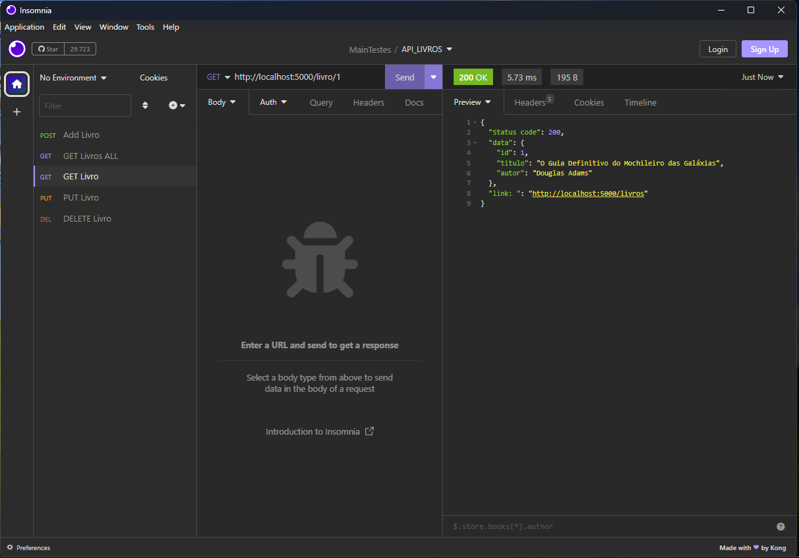

#

Api REST Básica para cadastros de livros através de novo modo declarativo do SQLAlchemy.

> Adriel Rosa (update 27/07/2023  18:51 PM)
##

## Funcionalidades:

### GET ALL

### GET ONE

### POST

### PUT

### DELET

## Tecnologias:
- Python
- Flask Framework:
- SQLAlchemy
- Sqlite3
- Git & GitHub

## Contato:

- E-mail: adrielrosa@live.com 
- LinkedIn: https://www.linkedin.com/in/adriel-rosa-660431144/
- Instagram: @adri3lr00
